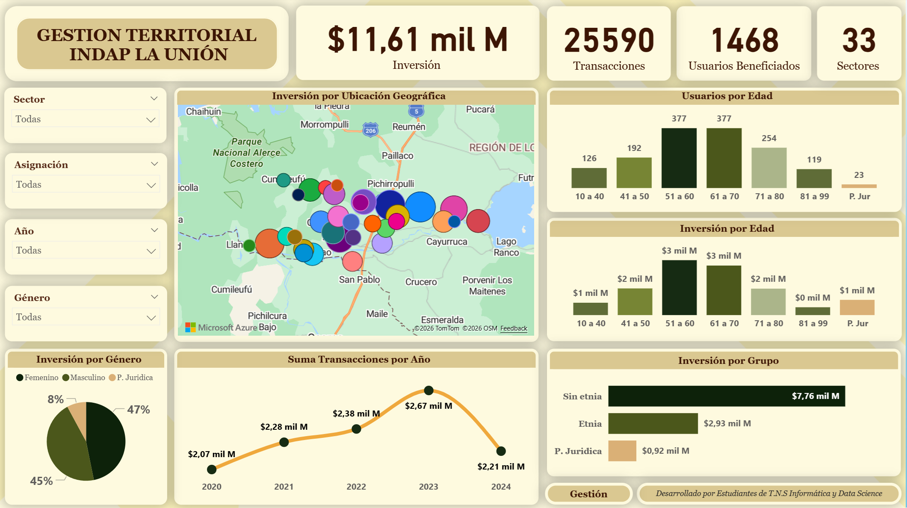
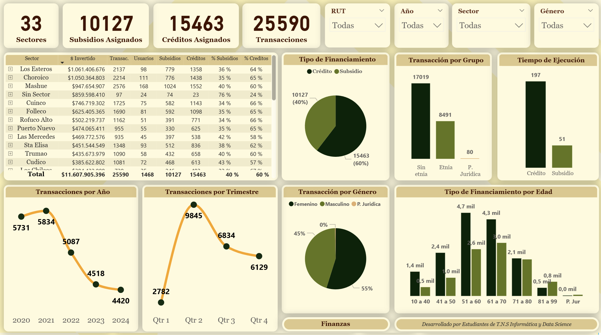

# INDAP Data Analysis Dashboard

Análisis y visualización de datos para gestión territorial de productores agrícolas en INDAP La Unión.

## Objetivo
Transformar una base de datos de productores agrícolas en información útil para apoyar la gestión territorial, identificar patrones relevantes y responder preguntas clave para la toma de decisiones.

## Contexto
Este proyecto se desarrolló a partir de una base de datos proporcionada por INDAP con información de productores agrícolas de la comuna de La Unión, Región de Los Ríos. A partir de esta base, se realizó un proceso de limpieza, análisis y visualización para generar indicadores críticos de gestión.

## Problema
La información disponible requería preparación y estructuración para poder ser analizada de manera efectiva y responder preguntas relevantes sobre asignaciones, créditos, intervención territorial, grupos etarios, género y composición étnica.

## Solución desarrollada
Se realizó un proceso completo de:
- limpieza y normalización de datos
- análisis exploratorio
- definición de KPIs de gestión
- construcción de visualizaciones orientadas a toma de decisiones

## Herramientas utilizadas
- Excel
- Power BI
- Power Query
- Python
- Análisis de datos

## KPIs e indicadores clave
- total de proyectos
- total de asignaciones y créditos
- proyectos por sector
- proyectos por productor
- asignaciones y créditos por sector
- asignaciones y créditos por productor
- eficiencia de ejecución
- distribución por grupos etarios
- distribución por grupos étnicos
- diferencias por género

## Preguntas de gestión que ayudó a responder
- ¿Qué productor ha recibido mayor apoyo?
- ¿Qué sectores han sido más intervenidos?
- ¿Qué diferencias existen entre géneros?
- ¿Qué diferencias existen entre grupos etarios?
- ¿Cómo se distribuyen créditos y subsidios territorialmente?

## Vista previa del proyecto

  
  

## Documentación adicional
- [Contexto de negocio](docs/business-context.md)
- [Proceso de limpieza de datos](docs/data-cleaning-process.md)
- [Insights e indicadores clave](docs/insights-and-kpis.md)

## Consideraciones
Este repositorio presenta una versión adaptada del caso real, sin exponer datos sensibles ni información interna.

## Contacto

Si quieres conocer más sobre este proyecto o mi trabajo en automatización y análisis de datos, puedes escribirme a:  
[claudio.duran.m@gmail.com](mailto:claudio.duran.m@gmail.com)
