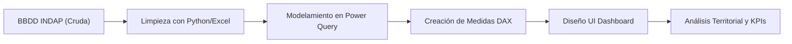

# 🚜 INDAP Data Analysis Dashboard

> Análisis y visualización de datos para la gestión territorial de productores agrícolas en INDAP La Unión.

## 📝 Objetivo
Transformar una base de datos de productores agrícolas en información útil para apoyar la gestión territorial, identificar patrones relevantes y responder preguntas clave para la toma de decisiones institucionales.

## 📖 Contexto
Este proyecto se desarrolló a partir de una base de datos proporcionada por INDAP, la cual contenía información sobre productores agrícolas de la comuna de La Unión, en la Región de Los Ríos. A partir de esta fuente, se ejecutó un proceso profundo de limpieza, análisis y visualización para generar indicadores críticos de gestión y distribución de recursos.

## 🎯 Problema
La información disponible requería un alto grado de preparación y estructuración para poder ser analizada de manera efectiva. Era necesario estandarizar los datos para responder preguntas relevantes sobre asignaciones monetarias, créditos otorgados, nivel de intervención territorial y características sociodemográficas de los beneficiarios (grupos etarios, género y composición étnica).

## 💡 Solución Desarrollada
Se realizó un proceso completo de *Business Intelligence* que incluyó:
- Limpieza y normalización de datos.
- Análisis exploratorio de los registros históricos.
- Definición de KPIs orientados a la gestión de recursos públicos.
- Construcción de visualizaciones interactivas para la toma de decisiones gerenciales.

## 🛠️ Herramientas Utilizadas
- **Lenguajes de Programación:** Python *(para automatización/tratamiento preliminar)*.
- **Herramientas de Análisis:** Microsoft Excel, Power Query.
- **Visualización:** Microsoft Power BI (DAX).

## 📊 KPIs e Indicadores Clave
- Total de proyectos financiados.
- Monto total de asignaciones y créditos otorgados.
- Proyectos distribuidos por sector geográfico.
- Concentración de proyectos por productor.
- Asignaciones y créditos segmentados por sector y productor.
- Eficiencia de ejecución presupuestaria.
- Distribución demográfica: Grupos etarios y composición étnica.
- Brechas de financiamiento por género.

## ❓ Preguntas de Gestión que Ayudó a Responder
- ¿Qué productor ha recibido la mayor cantidad de apoyo estatal?
- ¿Qué sectores territoriales han sido más intervenidos con recursos?
- ¿Qué diferencias de asignación existen entre géneros?
- ¿Cómo se distribuyen los apoyos según los distintos grupos etarios?
- ¿Cómo es la distribución territorial de los créditos versus los subsidios?

## 🔄 Flujo de Trabajo (Pipeline de Datos)

## 🔄 Flujo de Trabajo (Pipeline de Datos)

## 👁️ Vista Previa del Proyecto

  
  

> **Nota:** Las imágenes mostradas corresponden a una versión adaptada para fines de portafolio.

## 📚 Documentación Adicional
- 🏢 [Contexto de negocio](docs/business-context.md)
- 🧹 [Proceso de limpieza de datos](docs/data-cleaning-process.md)
- 📈 [Insights e indicadores clave](docs/insights-and-kpis.md)

## ⚠️ Consideraciones
Este repositorio presenta una **versión adaptada del caso real**. Para cumplir con la confidencialidad institucional, no se exponen datos sensibles, información personal de los productores ni métricas internas reales.

## 📫 Contacto
Si quieres conocer más sobre este proyecto o mi trabajo en automatización y análisis de datos, puedes contactarme:
- 📧 **Email:** [claudio.duran.m@gmail.com](mailto:claudio.duran.m@gmail.com)
- 💼 **LinkedIn:** [Claudio Durán Molina](https://www.linkedin.com/in/claudio-duran-molina-41580677)
